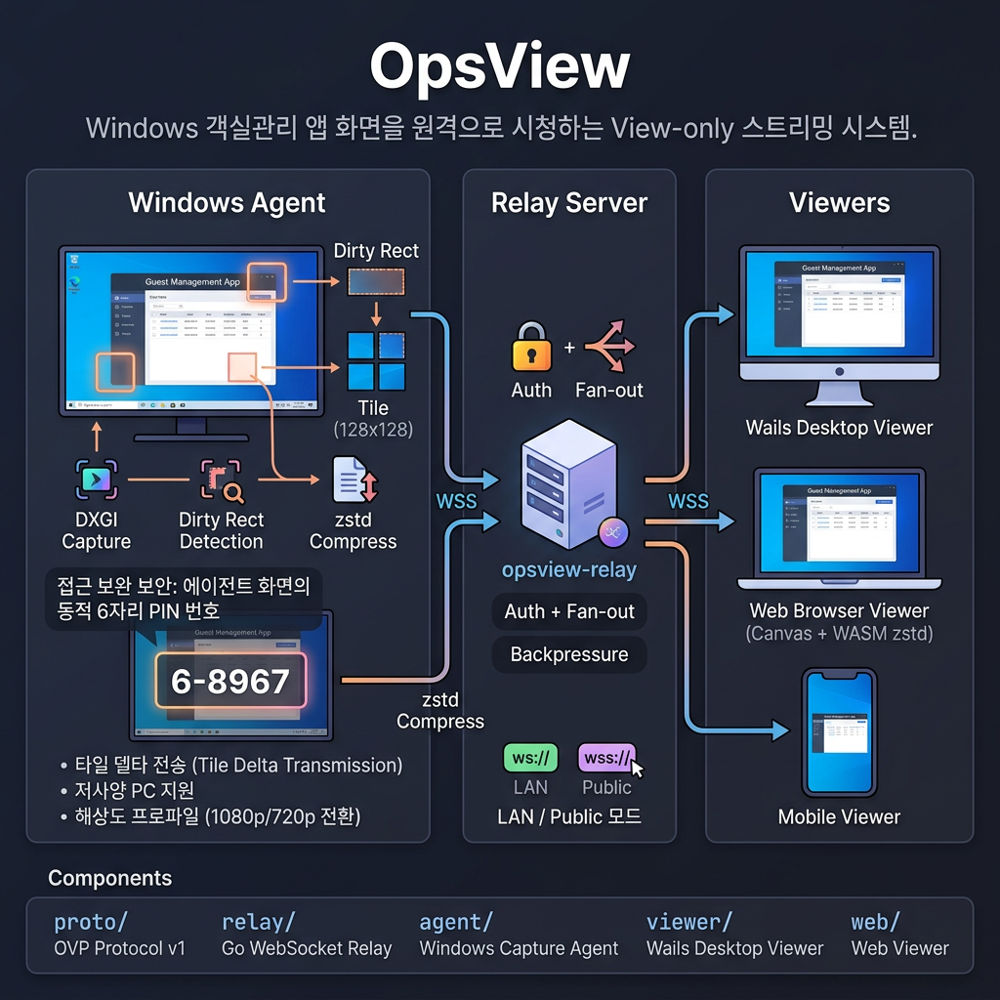
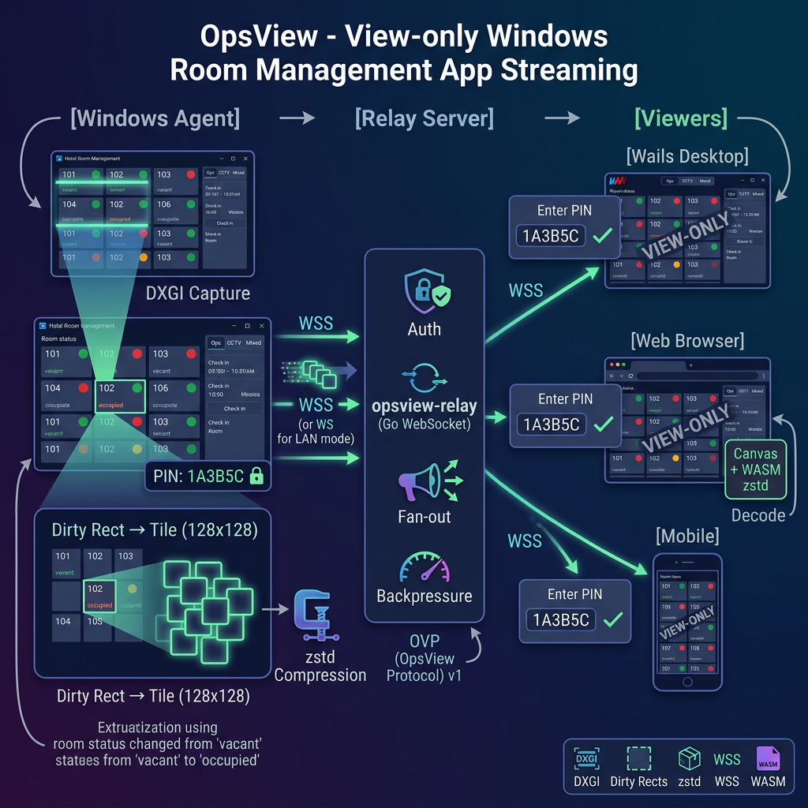

# OpsView

Windows 객실관리 앱 화면을 원격으로 시청하는 View-only 스트리밍 시스템.



## Architecture



- **타일 델타 전송**: 변경 영역(128x128)만 zstd 압축하여 전송 → 저사양 PC에서도 동작
- **LAN / Public 모드**: 내부 IP(`ws://`) 또는 공인 도메인(`wss://`) 모두 지원
- **해상도 프로파일**: 1080p / 720p 전환 가능
- **접근 보완 보안**: 에이전트 화면에 표시되는 동적 6자리 PIN 번호를 통해 Viewer 인증 통일

## Components

| Component | Path | Description |
|-----------|------|-------------|
| **proto** | `proto/` | OVP(OpsView Protocol) v1 바이너리 프로토콜 |
| **relay** | `relay/` | Go WebSocket 릴레이 서버 (인증, fan-out, backpressure) |
| **agent** | `agent/` | Windows 화면 캡처 에이전트 (DXGI Desktop Duplication) |
| **viewer** | `viewer/` | Wails 데스크톱 뷰어 (Ops / CCTV / Mixed 탭) |
| **web** | `web/` | 브라우저 웹 뷰어 (Canvas + WASM zstd) |

## Quick Start

```bash
# 0) Publisher 시크릿 설정 (필수). relay와 agent가 동일한 값을 사용해야 합니다.
#    미설정 시 relay는 기동을 거부합니다(fail-closed).
export RELAY_PUBLISHER_TOKEN=$(openssl rand -hex 16)

# 1) Relay 시작
cd relay
go build -o opsview-relay .
./opsview-relay

# 2) Agent 시작 (같은 RELAY_PUBLISHER_TOKEN 환경에서)
cd agent
go build -o opsview-agent .
./opsview-agent

# 3) 브라우저에서 시청 (에이전트에 표시된 6자리 PIN 입력)
open http://127.0.0.1:8080
```

> **보안:** `RELAY_PUBLISHER_TOKEN`은 publisher(agent)만 아는 공유 시크릿으로, 시청자 PIN과 별개입니다. 시청자는 여전히 6자리 PIN으로 인증합니다.

## Environment Variables

```bash
# Relay
RELAY_PORT=8080
RELAY_PUBLISHER_TOKEN=your-secret

# Agent
AGENT_RELAY_URL=ws://127.0.0.1:8080/publish
AGENT_TOKEN=your-secret
AGENT_PROFILE=1080   # or 720

# Viewer
WATCH_URL=ws://127.0.0.1:8080/watch
WATCH_TOKEN=pin-number
```

See [`.env.example`](.env.example) for full list.

## Documentation

- [Build & Run Guide](docs/BUILD.md)
- [OVP Protocol Spec](docs/PROTOCOL.md)

## License

Private - All rights reserved.
